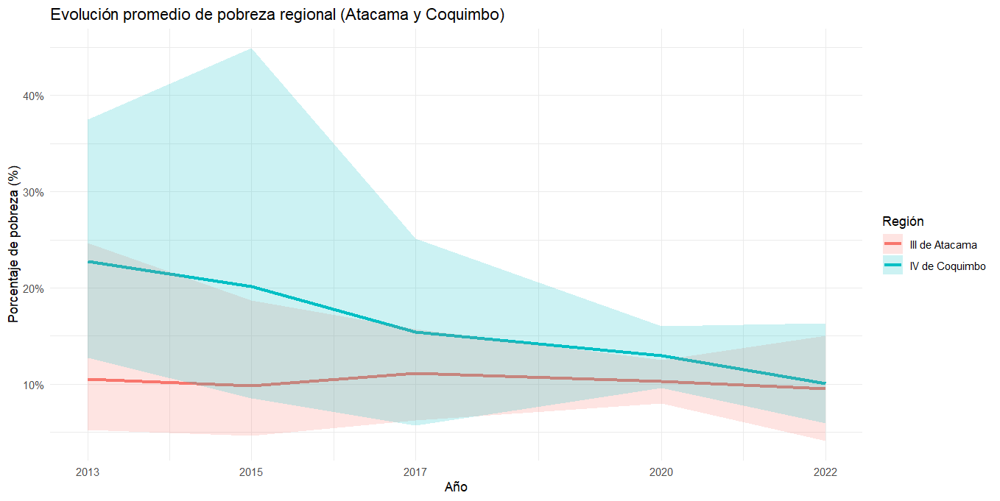
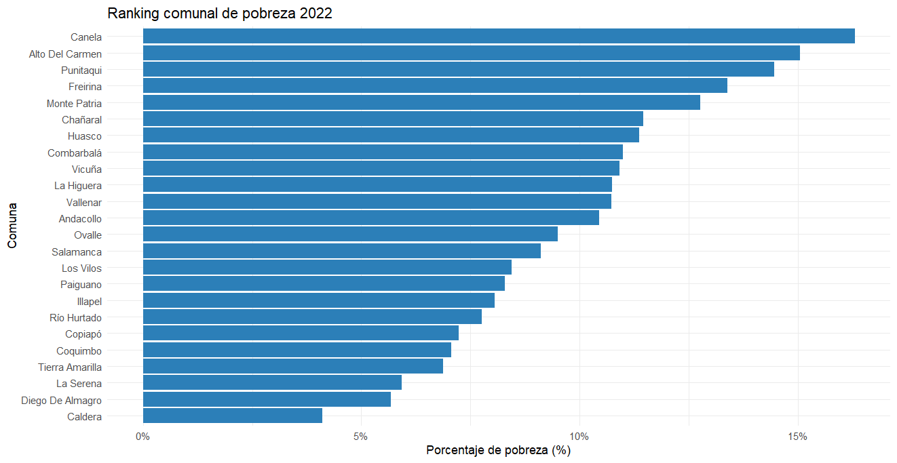
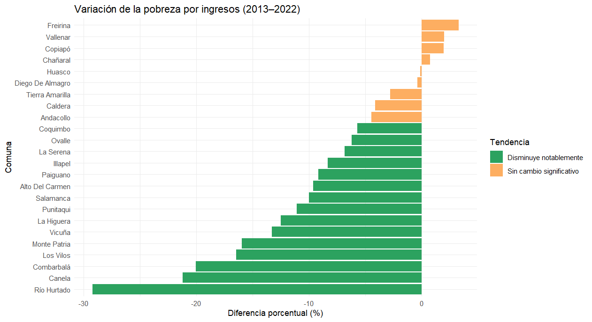

# 📊 Radiografía de la pobreza en el Norte Chico de Chile (2013–2022)

**Análisis reproducible de datos comunales de pobreza en Atacama y Coquimbo usando R**

---

## 📌 Descripción

Este repositorio contiene el código, datos y visualizaciones que acompañan el artículo publicado en Medium:  
[Radiografía de la pobreza en el Norte Chico de Chile (2013–2022)](https://medium.com/@brooks.teddy/radiograf%C3%ADa-de-la-pobreza-en-el-norte-chico-de-chile-2013-2022-contrastes-tendencias-y-el-8ea3a1aab0b1)

El objetivo es explorar cómo ha evolucionado la pobreza por ingresos comuna por comuna en las regiones de Atacama y Coquimbo, evidenciando contrastes, tendencias y desafíos para la diversificación productiva.

---

## 📁 Estructura del repositorio

- `data/` → Archivos CSV con tablas procesadas (BIDAT).
- `scripts/` → Script en R para ETL, AEE y visualización.
- `outputs/` → Gráficos generados listos para usar.
- `docs/` → Referencias complementarias (PDFs oficiales).

---

## ⚙️ Tecnologías usadas

- **Lenguaje:** R  
- **Paquetes clave:** tidyverse, ggplot2, ggrepel, scales

---

## 📈 Visualizaciones principales

### 1️⃣ Evolución promedio regional (2013–2022)

### 2️⃣ Ranking comunal 2022

### 3️⃣ Variación 2013–2022

---

## 📚 Fuentes

- Ministerio de Desarrollo Social y Familia. (s.f.). *Base de Datos de Estimaciones de Pobreza Comunal (BIDAT)*.
- Gobierno Regional de Coquimbo. (2024). *Estrategia Regional de Desarrollo de Coquimbo — Actualización 2024.*
- Gobierno Regional de Atacama. (s.f.). *Estrategia Regional de Desarrollo de Atacama.*
- Universidad de Atacama. (2023). *El encadenamiento productivo y la diversificación económica en Atacama.*
- Cámara Chilena de la Construcción. (2023). *Análisis Macroeconómico Región de Coquimbo.*
- ODEPA. (2018). *Información Regional Silvoagropecuaria.*

---

## 📬 Contacto

**Autor:** Teddy Brooks Caroca  
📧 [LinkedIn](https://www.linkedin.com/)  
📌 *Cualquier aporte, corrección o feedback es bienvenido.*

---

